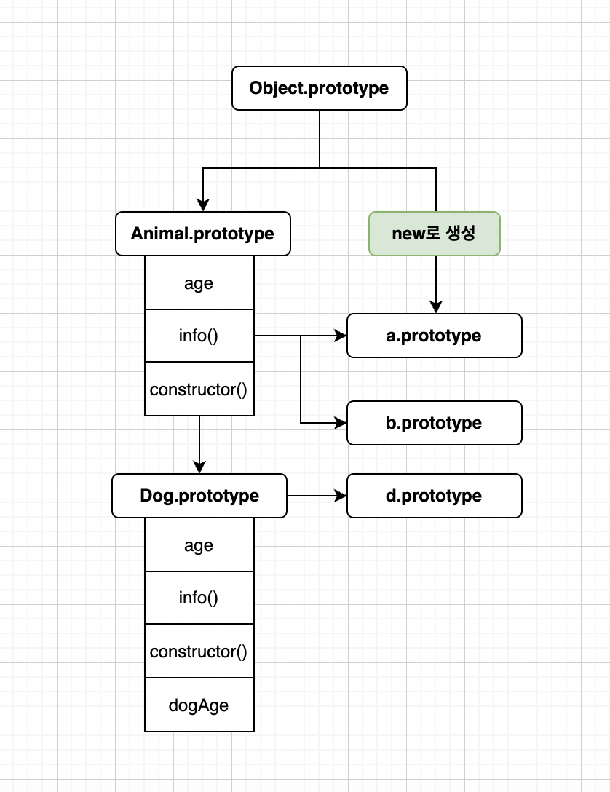

# Javascript_study_2022

```
***
youtube 시니어코딩님의 javascript 강의를 요약한 내용입니다.
***
```

<!-- prettier-ignore-start -->

- Javascript\_study\_2022
  - [편리한 vscode extension](#편리한-vscode-extension)
  - [web 개발용 extension](#web-개발용-extension)
  - [Javascript용 extension](#javascript용-extension)
  - [ESlint](#eslint)
- 변수와 상수
  - [1.cpu\&memory](#1cpumemory)
  - [2.Declaration과 Definition](#2declaration과-definition)
  - [3.변수(var,let)과 상수(const)](#3변수varlet과-상수const)
  - [4.scope와 존재](#4scope와-존재)
  - [5.호이스팅과 scope chain](#5호이스팅과-scope-chain)
  - [6.데이터 타입 , 변환](#6데이터-타입--변환)
- 함수
  - [1.함수란?](#1함수란?)
  - [2.인터프리터 언어 특징](#2인터프리터-언어-특징)
  - [3.실행 컨텍스트](#3실행-컨텍스트)
  - [4.closure](#4closure)

- 배열
  -[1.자바스크립트에서 Array](#1자바스크립트에서-Array)

- Date , Number, Math
## 편리한 vscode extension

- gitlens (git 관리 툴)
- bracket pair (bracket color 설정)
- indent-rainbow
- code spell Checker (코드 스펠링 체크)
- better comments (주석을 편리하게 달 수 있도록 돕는다)
- TODO highlight (todo , fixme 주석 하이라이트 기능)
- code spell Checker
- Auto-Open Markdown Preview (마크다운 프리뷰 제공)
- REST-client (RESTFUL API 호출 클라이언트 가볍게 사용가능)
- cobalt2 ,winter is commit (vscode theme 변경)
- material icon (파일 아이콘 theme)
- advance new file (파일 생성 편리하게 함) setting keyboard shortcut commend + n 으로 변경하여 더 편하게 사용
- file utils (파일 refactor)

## web 개발용 extension

- live sass (sass를 css로 자동으로 live로 변환해준다 , settings.json에 생성경로 지정, mapfile false 설정해 사요)
- open in browser (파일 브라우저에서 열기)
- auto rename tag (태그 열림 닫힘 한번에 바뀜)
- html css supporter (css에 생성한 class 등을 태그에서 자동으로 추천)
- intellisense css (사용된 class는 추천리스트에서 없앤다)
- css peek (html에서 css 정의 보여준다. cmd + click class)
- polacode(코드를 이미지로 뽑아낸다.)


## Javascript용 extension

- prettier (js code를 자동으로 포맷팅해준다 setting에서 format on save , format on paste 체크 , single quote , semi colon 등 검사)
- code snippets (javascript 관련 코드 스닙팻 제공)
- turbo shortcut(log 편리하게 찍음 shift alt c :파일내 로그 전체 주석 u: 주석해제 ,d:로그 삭제)
- quokka (메서드에서 사용되는 변수를 출력해준다 , 설치후 start from current file로 init)

## ESlint

- 코드스타일을 자동으로 잡아준다 ,airbnb의 코드스타일이 많이 사용된다.
- npm install eslint -g
- npm i -D prettier eslint-plugin-prettier eslint-config-prettier
- npx install-peerdeps --dev eslint-config-airbnb-base
- eslint --init (eslint 초기화)

---


# 변수와 상수
## 1.cpu&memory

- cpu는 트랜지스터의 집합이다. 트랜지스터는 전기신호를 통해 1과0을 표현 한다.
- or and xor 세가지 연산으로 모든 연산을 한다.
- 연산에 사용되는 모든 데이터는 메모리에 저장된다.
- 메모리의 최소단위를 cell이라 부르며 cell은 1byte로 8개의 1과0을 담을 수 있다.
- cpu와 메모리의 속도차이로인해 cpu에 cache라는 저장공간이 존재한다.
- java, js와 같은 고수준 언어는 compile과정을 거쳐 vm(virtual machine)에서 사용되는 byte code로 변환되고
- 변환된 byte code는 링크과정을 거쳐 cpu가 사용할 수 있는 기계어(machine language)로 변환된다.

```
//고수준언어(java , js ...)
x = 2 + 3;

▼
▼  변환
▼

//Assembly
PUSH 2 [1] // 2라는 값이 1번 메모리에 저장
PUSH 3 [2] // 3이라는 값을 2번 메모리에 저장
LOAD [1]   // 1번의 값을 가져온다
ADD [2]    // load 한값고 2번 메모리의 값을 더한다
STORE [12] // 12번에 연산된 값을 저장한다
```

---

## 2.Declaration과 Definition

- 선언(Declaration) : JS엔진에 식별자의 존재를 알린다 (메모리에 번지수를 잡아놓는다).
- 정의(Definition) : 선언 후 메모리에 값을 할당(Assign)한다.
- js에서는 선언만하면 undefined가 setting되기 떄문에 선언과 정의가 같다고 할 수 있다.
- 식별자는 변수의 이름을 말하고 글자 , $ , \_ ,unicode 문자로 시작할 수 있다. (예약어는 안됨)
- 리터럴은 값을 만드는 방법을 말한다 숫자 ,문자, boolean , null, undefined ,객체 ,배열 ,함수,정규표현식등이 리터럴로 사용된다.

```
var x = 1;

//x는 식별자(identifier)
//1은 리터럴(literal)

```

---

## 3.변수(var,let)과 상수(const)

- es5이전에서는 var를 사용했고 , es6부터 const,let이 사용됬다.
- var는 함수 scope , let과 const는 block scope를 갖는다.
- const는 상수를 의미하고 한번 할당되면 변경할 수 없다.

---

## 4.scope와 존재

- var는 함수 밖에서 존재하고 const,let은 함수 선언된 블럭 안에서만 존재한다.
- var의 단점은 함수 속에서 모두 접근이 가능하기 떄문에 오해를 일으킬 수 있다.
- scope는 동적측면 , 레벨 측면 두가지 기준으로 구분된다.
- 동적 측면으로는 정적 ,동적 스코프가 있다.
- 레벨 측면으로는 전역/지역 , 함수/블럭 스코프가 있다.
- 변수는 스코프 내에 존재한다.
- 동적 스코프는 실행순서에 따라 변수가 결정된다.
- 정적 스코프는 선언된 순서에 따라 변수가 결정된다.

> lexical scope vs dynamic scope

```js
예시 1)
var x = 1; // 전역변수
console.log('x >>', x);

function printX() {
  console.log('printX> ', x);
}

function main() {
  //여기서 x는 함수 스코프를 갖는다
  var x = 2;
  printX();
}
main(); // 정적 : 1 동적 :2

예시2)

document.addEventListener('DOMContentLoaded', () => {
  console.log('document is ready');
  for (var i = 0; i < 5; i = i + 1) {
    //i가 var로 선언되어 실제 클릭 이벤트가 일어날때 찍히는 값은 6이된다.
    console.log('🚀 ~ i:', i);
    document.getElementById(`span${i + 1}`).addEventListener('click', () => {
      //let으로 선언하면 i는 이 함수 안에서 보호받는다.
      console.log(i + 1);
    });
  }
});
```

> functional scope vs block scope

```js
function fbScope() {
  const t = true;
  // layer 1
  if (t) {
    console.log('inside if block');
    var v = 1;
    const x = 3;
    console.log(v, x); // 1 3
  }
  //x는 block 밖에 존재하기 때문에 undefined가 표시된다.
  //v는 block에서 선언됬지만 함수 스코프를 갖기때문에 number가 찍힘
  //v는 함수스코프이기 때문에 함수내에서 호이스팅이 일어나 layer 1 수준까지 올라간다.
  console.log(typeof v, typeof x); // number undefined
}
//함수 실행
fbScope();
```

---

## 5.호이스팅과 scope chain

- js와 같은 함수형 언어는 다 정적 스코프를 갖는다.
- js에서는 var let const function 모두 호이스팅이 적용된다.
- 각각의 scope에 따라 호이스팅이 이뤄진다.
- scope chain은 가시성(visibility)를 말하며 외부에서는 내부 변수에 접근을 불가하도록 하는것을 말한다.

```js
//위치1
console.log('x1>>', x);
x = 1;
//호이스팅이 일어나기 떄문에 x는 위치1에 선언된 것과 같다.
var x;

//함수도 호이스팅이 일어나기 때문에 실행이 가능하다.
f1();

function f1() {
  //y접근 불가
  console.log(y);
  function f2() {
    var y = 2;
    function f3() {
      //y 접근가능
      console.log(y);
    }
    f3();
  }
  f2();
}
```

---

## 6.데이터 타입 , 변환

> 원시 타입(primitive, immutable) call by value

- 숫자 , 문자열 ,불리언 , Null ,undefined , symbol
- 숫자(double : 8B , int/float: 4B , Infinity, NaN)
- 문자(알파벳 1B , Unicode 3B , Emoticon : 3~6B)
- 문자열 Backtick(Template Literals)

> Object(Mutable) 타입 call by Reference

- Array, Date, RegExp , Map, WeakMap , Set,WeakSet


> undefined 와 null의 차이

- undefined는 메모리에 값을  저장할  셀 주소만 잡아놓는다. 그 셀은 비워져 있을 수도 있고 garbage가 있을 수도 있다.
- null은 메모리에 저장될 셀을 아예 비운다. 직접 비우진 않고 gc 될 수 있도록한다. 

---
# 함수
## 함수선언과 함수 표현식

- 함수 선언문은 호이스팅 대상이 된다.
- 함수도 오브젝트다 하지만 함수는 function object라고 따로 분류 되어 메모리에서 관리된다.
- 함수 선언은 static영역에 표현식은 heap에 잡힌다.
- 함수는 엔진에 의해 평가와 실행이 이뤄진다.
- 함수 선언은 소스코드에 대해 평가가 이뤄지지만 함수 표현식은 실행되기 전까지 평가가 이뤄지지 않는다.
- 함수 표현식에서 함수는 실행될때 인스턴스화되어 heap에 잡힌다. 그전까지는 undefined 상태이다.
- new Function()으로 생성된 함수는 클로저가 적용되지 않는다.
- 함수 안에서 arguments라는 변수에 함수호출시 들어오는 인수의 배열이 담겨있다.

```js
//함수 선언
function a(){
  console.log('함수선언');
}
//함수 표현식
const a = function(){
  console.log('표현식')
}
```

## 함수가 메모리에 잡히는 방식
- 평가가 일어나면 선언된 각 함수들은 각각의 실행 컨텍스트를 갖는다. 
- 실행 컨텍스트에는 함수안에서 사용되는 변수들의 메모리 위치가 잡히고 
- 실행이 이뤄질때 해당 변수의 값이 채워진다.
- 각 함수의 실행 컨텍스트에는 함수 바깥의 변수를 참조하기위해 바깥을 가리키는 포인터가 저장된다. (전역으로 선언된 함수는 global(window객체) 지역함수는 자신의 부모에 대한 포인터를 갖는다.)

## this
- 일반함수의 this는 전역 (window 객체)을 가리키고
- new 로 생성된 인스턴스의 this는 메모리에 잡힌 자기 자신을 가리킨다.
- 화살표 함수의 this는 일반함수와 달리 바로 상위의 변수를 가리킨다.
- bind()는 함수에서 사용할 this를 직접 할당해주는 함수이다 
- apply() , call은 this를 직접 할당해서 함수를 실행시킨다.
- apply() ,call()은 함수안에 this가 바뀌어서 들어올 수 있기 떄문에 이를 활용해 자바스크립트에서 다형성을 구현할 수 있다.
```js
name = 'ugo'

setTimeout(function(){
              console.log(this.name);  // 여기서 this는 window를 의미한다 
            }, 1000)
-----

name = 'ugo'

setTimeout(()=>{
              console.log(this.name);  // 여기서 this는 바로위 name을 의미한다  
            }, 1000)


---
a = new A('hwang');

function f1(x,y){
  console.log(this.name,x,y);
}

//f1은 일반함수이기 때문에 this는 전역을 가리킨다.
//bind를 통해 f1의 this를 a로 지정할 수 있다.
f1.bind(a)

//apply와 call은 this를 지정하면서 함수를 실행시킨다
f1.apply(a,[1,2]);
f1.call(a,1,2);

```


## 일반함수와 class
- 자바스크립트에서는 class도 함수다.
- 일반함수는 f1(); 과 같이 호출되는 함수를 말하고 method는 클래스에 속해있는 함수들을 말한다.
-  new f1()과 같이 new 키워드를 통해 생성할때 클래스에 constructor(생성자)함수가 존재하면  constructor 함수를 호출하고 없으면 함수 그 자체 생성자 함수가  되어 호출된다.
- 인스턴스화 되지 않는 일반함수에서 this는 window 객체를 가르킨다.
- 모든 클래스는 최상위 객체인 Object 상속받는다. Object에 proto 변수에는 상속을 받는 클래스들의 메서드들이 등록된다.
```js
//생성자 없음
class f2{
    
}

new f2(); // f{}가 호출됨

//생성자 있음
class f3(){
  const a = 1;
  constructor(){
    console.log('생성자')
  }
}

new f2() //constructor()가 호출된다


```

---

## 2.인터프리터 언어 특징

- 인터프리터 언어는 컴파일 과정이 없다 . 코드 실행전 평가(interpreting)라는 과정을 거친다.
- 평과 과정에서 선언된 변수들이 확인되고 실행시 값이 셋팅된다.
- 인스턴스는 각자의 스코프에 따라 생성시점이 결정된다.
- 컴파일 언어는 타입을 통해 컴파일시 메모리 위치와 사이즈를 미리 확보한다. 
- 반면 인터프리터 언어는 실행시에야 그 타입이 알 수 있기 떄문에 메모리 사이즈를 미리 확보하지 못하는 단점이 있다.(메모리를 확보하는 것은 무거운 작업이다.)
- 때문에 하드웨어가 좋지 못했던 예전에는 인터프리터 언어가 각광 받지못했지만
- 하드웨어 성능이 좋아진 요즘은 좀 더 간편하게 사용 할 수 있기 때문에 많이 각광 받기 시작했다.
- 선언된 함수는 메모리에 위치만 잡히고 호출될때 함수 블럭안의 코드들이 평가가 이뤄진다.


---
## 3.실행 컨텍스트(execution context)
- 자바스크립트에서 실행 가능한 코드는 전역 , 함수 , eval, module 있다.
- 위의 네가지 실행 가능한 코드는 각자의 스코프를 갖는다.
- 자바스크립트 엔진은 코드 평가를 거친후에 코드를 실행한다.평가 과정에서 실행 컨텍스트를 잡는다.
- 실행 컨텍스트는 실행되는 실행 코드마다 갖게되는 고유의 영역이며 컨텍스트가 call stack에 쌓여서 lifo(last in first out) 방식으로 실행된다.
- 코드가 평가될때 스코프 단위로 실행 컨텍스트가 생성된다. 가장 먼저 생성되는 것은 전역 실행 컨텍스트이다.
- 실행 컨텍스트 안에는 lexical environment라는 영역이 생성된다. 
- lexical environment에는 실행 컨텍스트에서 사용될 모든 데이터 저장될 environment record와
- 외부 참조 값이 저장될 outer lexical environment reference가 생긴다.(참조값을 통해 외부에 접근하여 데이터를 찾아온다.)
- lexical environment는 Object Environment record , Declarative Environment Record(ES6이후로 생김)로 나뉜다
- Declarative Environment Record는 var const let등으로 선언된 변수들에 대한 데이터가 저장된다.
- 환경 레코드는 중첩된 참조를 갖는다 , 이러한 방식을 렉시컬 스코프라하며 중첩된 참조를 따라 값을 참조하는 방식을 스코프 체이닝이라한다. 
- 실행컨텍스트의 lexical environment가 외부에서 참조되고 있다면 실행컨텍스트가 call stack에서 제거되도  lexical environment는 남아있는다.
```js
var g1 = 1;
const c1 = 2;
function gfn(x){
  var v1 = 3;
  const c2= 4;
  g1=11;
  function fn(g){
    const c2 = 5;
    console.log(x+v1+c2+g+g1)
  }
  fn(6);
}
gfn(100)

```


---

## 4.closure
- 하위 스코프가 상위스코프에는 접근할 수 있지만  반대는 불가능하다.
- 중첩함수에서 자식함수가 부모함수의 실행이 끝나 콜스텍에서 제거됬더라도 부모함수의 변수에 접근할 수 있는 것을 클로저라고 한다.
- 클로저가 가능한 이유는 함수 실행이 끝나면 실행 컨텍스트가 사라지지만 만약 실행컨텍스트의 environment recode에 있는 데이터가
- 다른 컨텍스트로부터 참조되고 있다면(link 되어있다면) 스택영역의 실행 컨텍스트는 사라지지만 힙 영역에 environment recode는 GC의 대상이 되지않고 살아남기 때문에 접근이 가능하다. 
- 이때 중요한점은 실행 컨텍스트에 대한 environment recode는 또 다른 중첩 함수에 의해 참조될수 있기떄문에(만약 또 중첩함수가 있다면 해당 중첩함수가 실행되기전까지는 평가하지않기 떄문에 함수 안에 정의된 코드를 알 수 없다.) environment recode를 통쨰로 살려 놓는다.

```js

//closure 예시

function a1(){
  const b = 10;
  function a2(){
    console.log(b);
  }
  return a2;
}

// a2()가 리턴된다.
const v1 = a1();   
v1(); // 10이 출력된다.

```

## 5. class
- js에서는 prototype을 통해 클래스가 구현되며 모든 클래서는 최상위 클래스인 Object 클래스의 프로토타입을 상속 받는다 이때 template와 static 변수 함수 , 생성자 함수등 이 정의되는 function prototype ,new 키워드를 통해 생성되는 instance prototype이 각각 생성된다. 
- instance prototype은 new를 통해 생성될때  function prototype에 정의된 변수 , 함수를 가져와 생성된다. 
- 자바스크립트에서 class는 표현식만 다르고 결국은 모두 function으로 구현된다.
- 멤버변수는 따로 선언하지 않고 constructor안에서 this.변수로 선언한다.
- 정적 변수혹은 메서드들은 static이라는 키워드를 사용해 정의한다. static 변수 함수는 모든 인스턴스에서 공유되어 사용된다.
- getter setter private method를 구현할 수 있다.

```js

class Dog extends Animal {
  #sound = 'walwal'; //#을 붙히면 private 변수가 된다.
  constructor(nm, da, col) {
    super(nm);
    this.dogAge = da;
    this.color = col;
    this.wal = function wal() {
      console.log(this.#sound);
    };
  }
  //getter 정의
  get sound() {
    return this.#sound;
  }
  //setter 정의
  set sound(sound) {
    this.#sound = sound;
  }
}
const a = new Animal('human');
const b = new Animal('monkey');
const d = new Dog('jindo', 10, 'brown');

Dog.info();
console.log(d.dogAge);
console.log(d.color);
d.sound = 'wackwack'; //setter 호출
const dogSound = d.sound; //getter호출
console.log(dogSound); //wackwack

```

<br/>



---
# 배열

## 1.자바스크립트에서 Array
- ECMA 표준규격에 맞춰 각각 구현하기 떄문에 언어 , 엔진에 따라서  배열의 구현이 다르다. 
- 배열을 조작하는 함수중 원본 배열에 영향을 주지않는 함수를 순수함수라한다.(slice,concat,map,filter ... )
- 자바스크립트에서 a=[1,2,3]과 같은 배열은 {0:1,1:2,2:3,length:3}과 같이 키(인덱스)벨류(참조값)오브젝트로 메모리에 저장된다.
- 이떄 배열의 각 요소들은 hash함수를 통해 주소가 정해진다.
- 자바와 같은 컴파일 언어에서는 컴파일시 타입이 결정되고 배열의 메모리가 확보되기때문에 보다 촘촘하게 데이터가 저장되며 이를 컴퓨터 공학에서 dense array라 한다.
- 반면에 자바스크립트와 같은 인터프리팅언어에서 배열은 hash 테이블 구조로  만들어지기 떄문에 한번정해진 배열은 중간에 값이 삭제되면 값만 삭제되고 공간은 남아있기떄문에 배열의 길이가 줄어들거나 하지 않아 드문드문한 형태로 남는데 이와같은 배열을 spars 배열이라고 한다. 
- 스펙상으로 자바스크립트에서 array의 길이는 2의 32승-2(맨처음,맨끝을 뺌)까지 가능하다.


---

## Number 와 Math
## String과 정규식


---
## Symbol


---


## 브라우저 렌더링과정
1. 주소창에 url을 치면 서버 index 파일을 응답해준다.
2. index.html에 포함된 css js img 파일을 요청한다 .
3. css를 바탕으로 dom을 그리고 , js파일이 실행된다


- http 버전에 따라 2번과정의 차이점이 있다.
- http 초기버전의 경우 css js img를 각각 받아왔다. 
- 하지만 커넥션을 다시 맺는 과정은 꾀나 무거운 과정이기 때문에 응답속도가 많이 느려진다.
- 이를 해결 하기위해 keep alive라는 속성을 사용해 일정시간동안 커넥션을 유지하는 방식으로 커넥션을 다시 맺는 과정을 줄였지만 서버에서 해당 커넥션을 너무 오래 유지 하게되어 커넥션 순환이 이뤄지지 않아 동시접속자 수가 줄어드는 단점이 있다.
- 위와 같은 단점을 해결하기위해 브라우저 쪽에서 요청시 여러개의 커넥션을 병렬로 연결하여 한반에 여러개 파일을 병렬로 가져오는 방식을 사용하기도 했다(keep alive보다 서버 부담 낮음)
- 시간이 갈수록 서버들의 성능이 좋아지며 http2.0 부터 keep alive 속성이 default로 true로 설정되고 css js img 파일들에 대한 요청도 병렬로 한번에 불러오는 방식으로 바뀌었다.
- defer 키워드는 script 파일이 DOM이 그려진 후에 읽어지도록 한다.
<!-- - 요즘은 <script> <link>와 같이 파일을 불러오는 테그들을 바디 맨아래에 적어놓는다.
- dom을 그린후에 파일을 읽어오기 header에 위치하는 것보다 체감상 빠르다 -->


## DOM

### DOM 이벤트
- 이벤트 발생시 가장 바깥의 root로부터 이벤트 타겟인 노드까지 이벤트가 내려온다.
- 부모태그와 자식태그의 이벤트가 겹칠시 이벤트는 부모태그가 먼저 받지만 실행은 타겟이 되는 태그가 먼저 된다.
- 이벤트리스너에서 e.stopPropagation()를 호출하면 부모 노드에 이벤트를 실행하지 않도록한다.
```html
<body>
  <div
    style="width: 200px; height: 200px; background-color: aqua"
    onclick="console.log('div click')"
  >
    <button onclick="console.log('btn click')">asd</button>
  </div>
  <script src="./index.js"></script>
</body>

//> btn click
//> div click
```